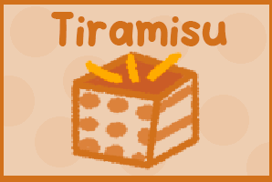
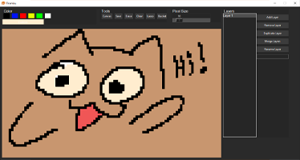

# Paint App Tiramisu



## 🖌️ What is Tiramisu?

**Paint App Tiramisu** is an open-source pixel art application entirely developed in **Python** and designed for pixel art.

---



## 🎨 Key Features

- **Layer Support**: Add, duplicate, delete, and merge layers for better control of your artwork.
- **Drawing Tools**:
  - Pencil for precise pixel-by-pixel drawing.
  - Eraser for removing specific areas.
  - Clear canvas option for starting over.
- **Color Palette**:
  - Predefined color options.
  - Custom color picker to create personalized shades.
- **Adjustable Pixel Size**: Modify the size of the pixels for enhanced control.
- **Save Your Artwork**: Export your creations as transparent PNG files.
- **Modern Interface**: A sleek, dark-themed interface designed for comfortable, extended use.

---

## 🚀 Installation and Usage

1. **Clone this repository**:
   ```bash
   git clone https://github.com/Noodle-Dev/Paint_App_Tiramisu.git
   cd Paint_App_Tiramisu
